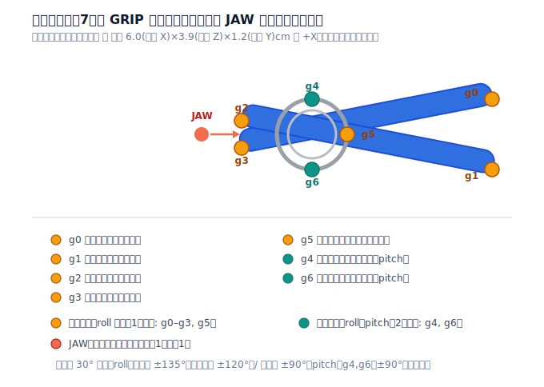

# Clothespin Studio 🧷

洗濯バサミ（クリップ式）を組み合わせて大規模な構造物を設計するための Web アプリケーションです。
LEGO 向けの [BrickLink Studio](https://www.bricklink.com/v3/studio/main.page) の「洗濯バサミ版」を目指します。

3D 空間上で洗濯バサミ同士を **クリップで挟み合って** 連結し、設計したモデルを各種形式でダウンロードできます。

**🌐 公開版: https://fumito-ito.github.io/Clothespin-Studio/** （main への push で自動デプロイ）

---

## このリポジトリの現状

**MVP（M3）実装済み**です。以下が動作します:

- 3D ビューポートでのルートピン配置（地面クリック / 1cm スナップ）
- ソケットクリックでのスナップ連結（7 つの GRIP ソケット + JAW）、roll / pitch 回転（30° 刻み）
- 色指定（3 色パレット）・削除・Undo/Redo
- 部品表パネル（色別集計）・プロジェクト保存 / 読込（JSON）・部品リスト CSV 出力
- InstancedMesh による大規模描画（5,000〜10,000 ピンで動作確認済み）

今後: glTF/STL/PNG 出力・配置プレビュー・複製・自動バックアップなど（[05 ロードマップ](docs/05-roadmap.md) M4）。

## ドキュメント

| ドキュメント | 内容 |
| --- | --- |
| [01 要件定義](docs/01-requirements.md) | 目的・スコープ・想定ユーザー・機能要件 / 非機能要件 |
| [02 洗濯バサミ仕様](docs/02-clothespin-spec.md) | 形状・寸法・ローカル座標系・接続点（JAW / GRIP）の定義 |
| [03 データモデル & ファイル形式](docs/03-data-model.md) | ドメインモデル・連結モデル・JSON / CSV / glTF / STL / PNG 仕様 |
| [04 アーキテクチャ](docs/04-architecture.md) | 技術スタック・ディレクトリ構成・状態管理・描画/性能戦略 |
| [05 ロードマップ](docs/05-roadmap.md) | マイルストーン・MVP 定義・バックログ・未決事項 |

## 決定済みの基本方針

- **結合方式**: クリップで挟み合う（接続点ベースのスナップ）
- **表示/編集**: 3D
- **技術スタック**: React + Three.js（React Three Fiber）+ TypeScript（クライアント完結 / バックエンドなし）
- **エクスポート**: 独自プロジェクト JSON / 部品リスト CSV / 3D モデル glTF・STL / 画像 PNG

## 洗濯バサミの基準仕様

- 標準サイズ: **幅 3.9 × 奥行 6 × 高さ 1.2 cm**（クリップ式 / 金属スプリング付き）
  ※設計ドキュメント内では 長さ 6.0 × 高さ 3.9 × 厚み 1.2 cm の呼称に統一（対応表は [02 §2](docs/02-clothespin-spec.md)）
- 接続点: **GRIP ソケット 7 点**（ハンドル先端×2 / ジョー先端×2 / スプリングリング×3）+ **JAW コネクタ 1 点**
- 標準カラー: ブルー `#0C48A3` / ホワイト `#FFFFFF` / ウォームグレー `#B1A29A`
- 形状の基準: [docs/assets/clothespin-frame.svg](docs/assets/clothespin-frame.svg)



## 開発

```bash
npm install
npm run dev      # 開発サーバ (http://localhost:5173)
npm run build    # 本番ビルド（型チェック込み）
npm test         # ユニットテスト (vitest)
npm run lint     # ESLint
npm run format   # Prettier
```

開発ビルドでは `window.__studio`（ストア）と `window.__stress(n)`（n ピンの負荷テストシーン生成）が使えます。
